# Melhor Busão

Melhor Busão is an app designed to simplify public transportation users daily life by providing them with information on buses routes, schedules, stops location/time and bus/trip evaluations. 

## Features

- Top Bus - Route rank according to trip factors like: driver, crowding and vehycle condition
- Nearby Stops - Find stops around current/selected location
- Route Map - See route map along with stops locations
- Bus schedule - Check bus schedule for a route in a specified stop location
- Automatic Route detection - Detect route during user trip
- Favorite bus(es) [in progress] - Keep users favorite buses
- Bus Trip evaluation - Evaluate a bus trip after taking it

## Screenshots

  
  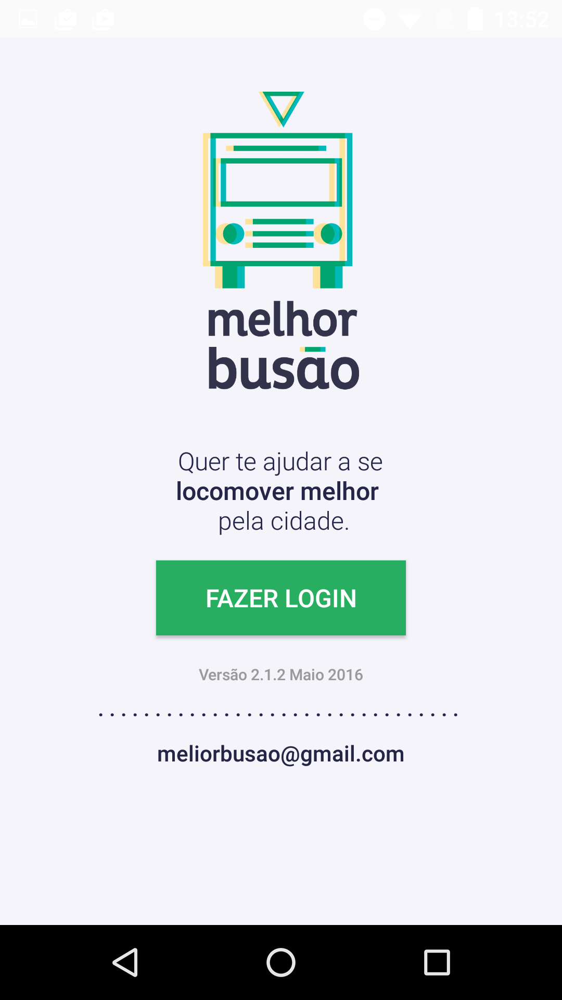
  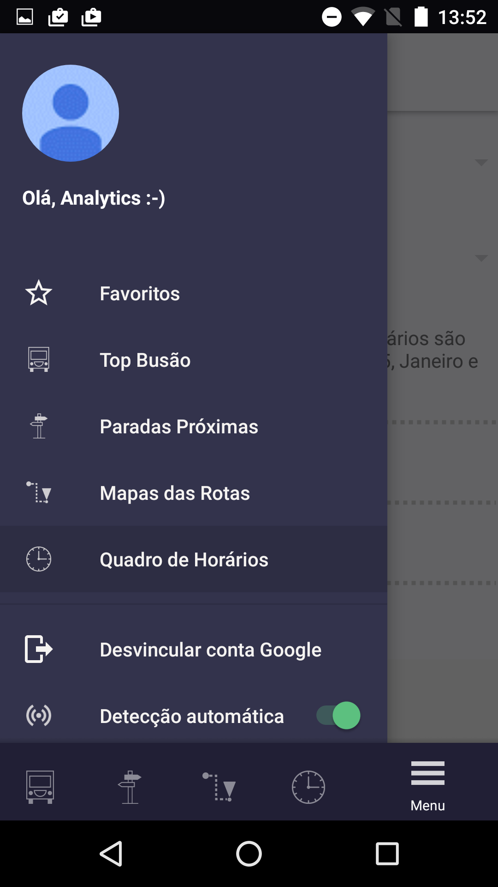
  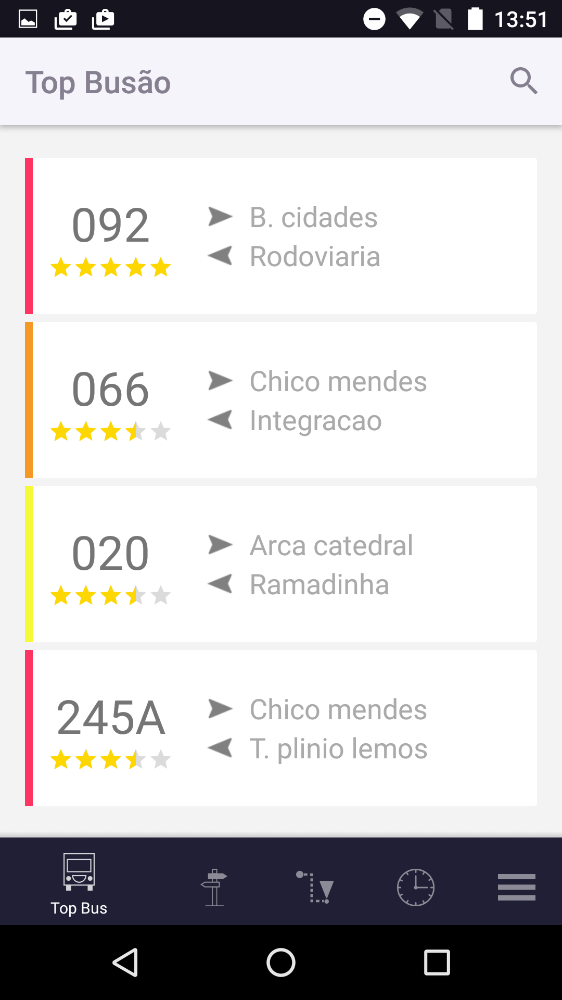
  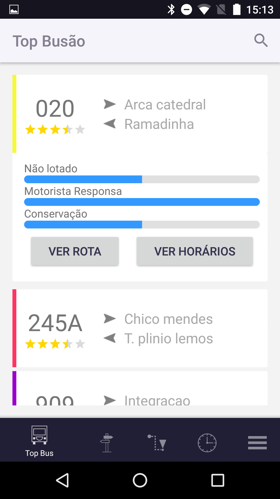
  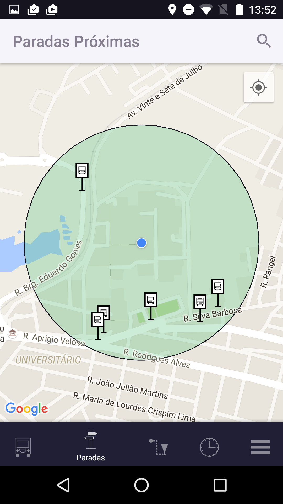
  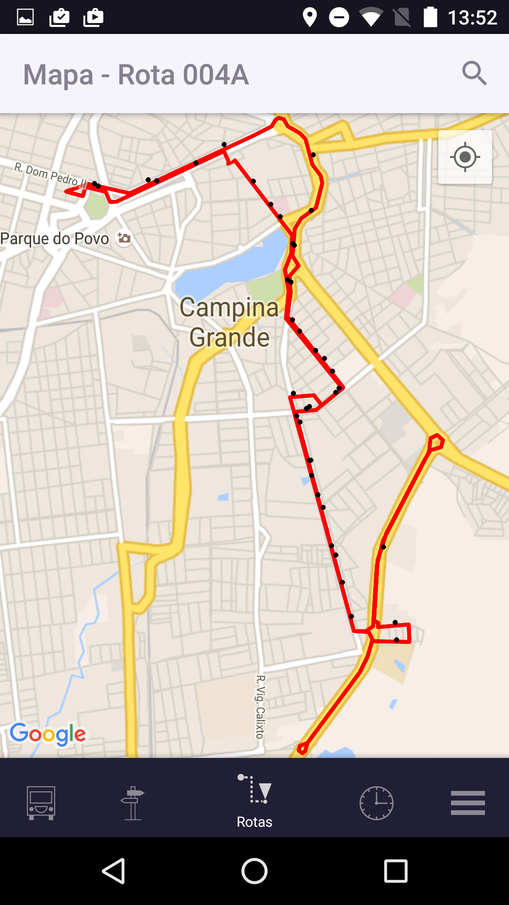
  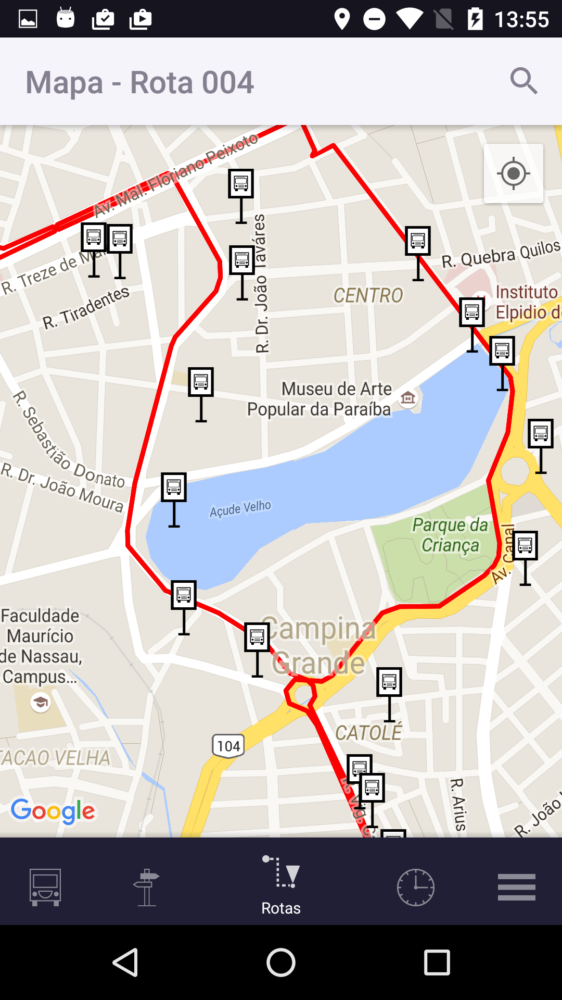 
  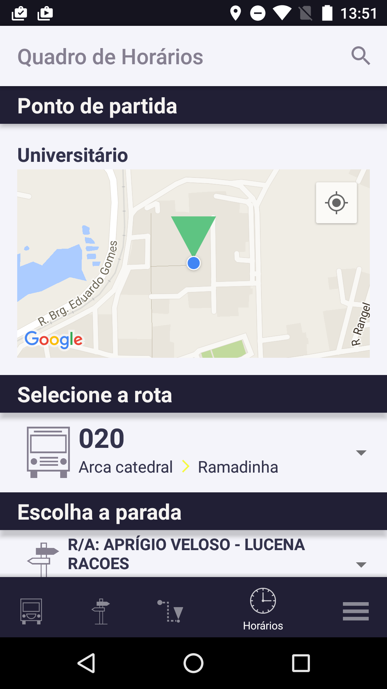
  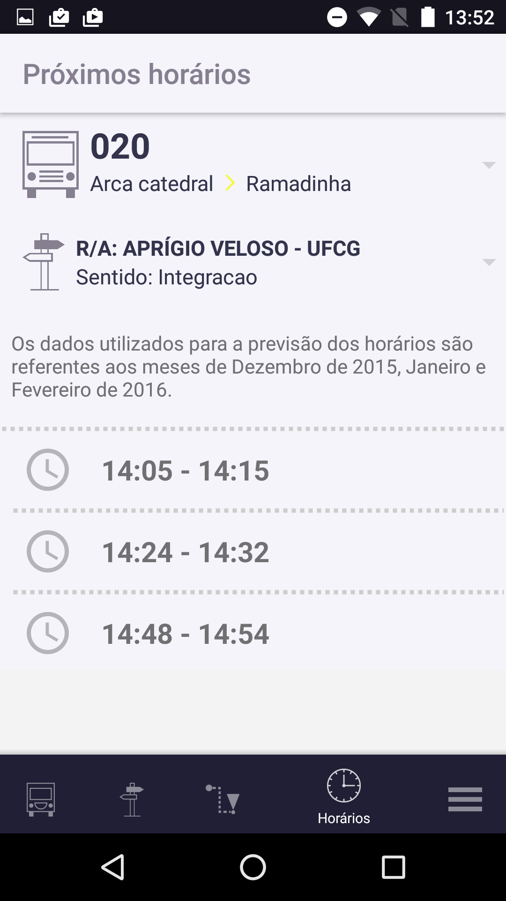

### Build

This repo contains the official source code of Melhor Busão for Android.

Current app version is 1.1.

Steps on how to build Melhor Busão:  

- Make sure you have the latest version of Android Studio with Gradle and the required Android SDK Tools installed (23.3.0 Build Tools)  
- Clone this repository  
- Open Android Studio -> File -> Import Project  
- Select build.gradle in Melhor Busão folder  
- Go to Project Structure and make sure Android SDK and JDK paths are set  
- Build -> Rebuild Project and Sync Gradle  
- Good to go!

##Melhor Busao - Overall Architecture
The architecture of Melhor Busão is composed of five components: Data Crawler, Static Data Processor, Dynamic Data Processor, Recommendation Service Mananger and Melhor Busao App.

  

###Data Crawler

The Data Crawler is composed of a web crawler that captures the data and sends them to the processor components. The data follows two streams: the first processes the static data and forwards it to the application; the second stream processes the dynamic data and the forwards it to the Recommendation Service Manager.
  - Data captured:
    - Static Data: GTFS (General Transit Feed Specification);
    - Dynamic Data: GPS, Ticketing Data;

###Static Data Processor

  

After static data is acquired, it is cleaned, assembled and formatted. Then Melhor Busão database is created and its dump is uploaded to the cloud. When the application is launched for the first time, Melhor Busão database dump is downloaded to the device, according to user location.

###[Dynamic Data Processor](https://github.com/analytics-ufcg/bigsea-transporte)

###[Recommendation Service Mananger](https://github.com/analytics-ufcg/melhorbusao/tree/master/R/best_trip_recommender)

--- 

###App Componentes

**Login**

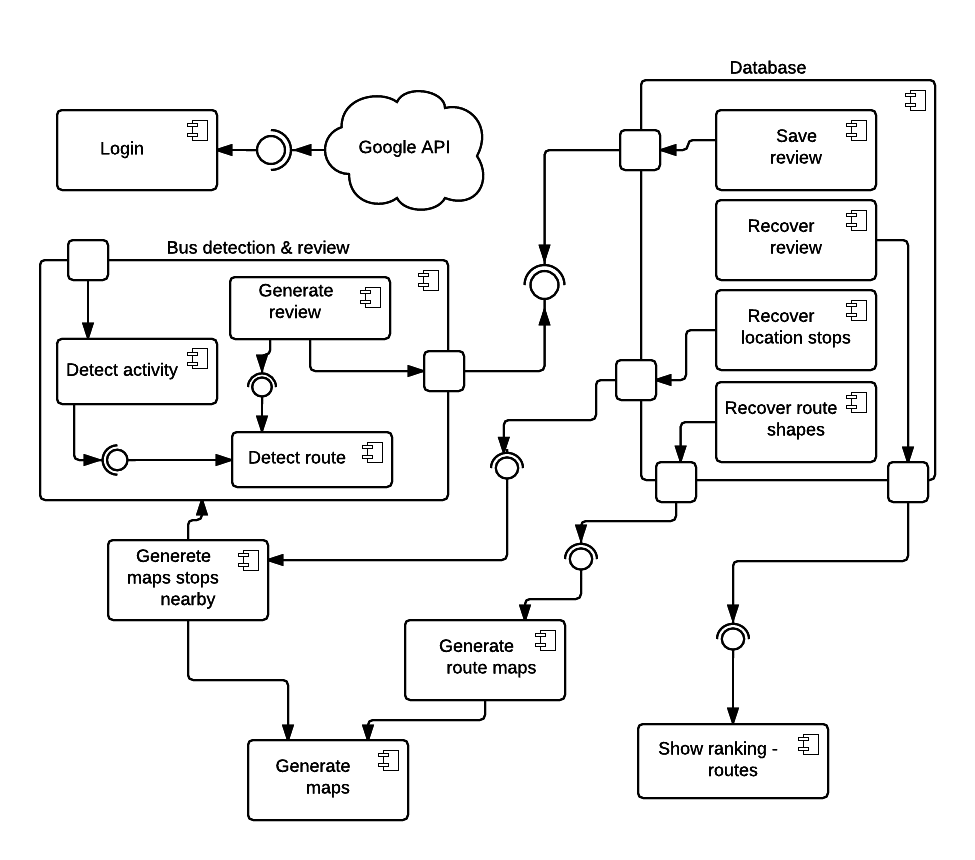

Login is done through the user’s Google account.
The user activity detection is started when it moves, in order to figure out if it’s possible to be in a bus, if so, the app starts to record the route traveled (latitudes and longitudes).
At the end of the route the app will, based on the stored information, try to guess which bus (route) the user was and provide an interface to evaluate the journey made (number of people on bus, conservation, driver, ...).
After the user completes the evaluation, it is stored in the DB.
An anonymous summary (Ranking of Buses) can be seen on the screen Top Bus, from the Recovery of the evaluations.
The map of Nearby Stops can be viewed through the recovery of Near Stops.
The map with the buses’ routes can be viewed through the recovery of the shape of the routes.

**Near Stops**

  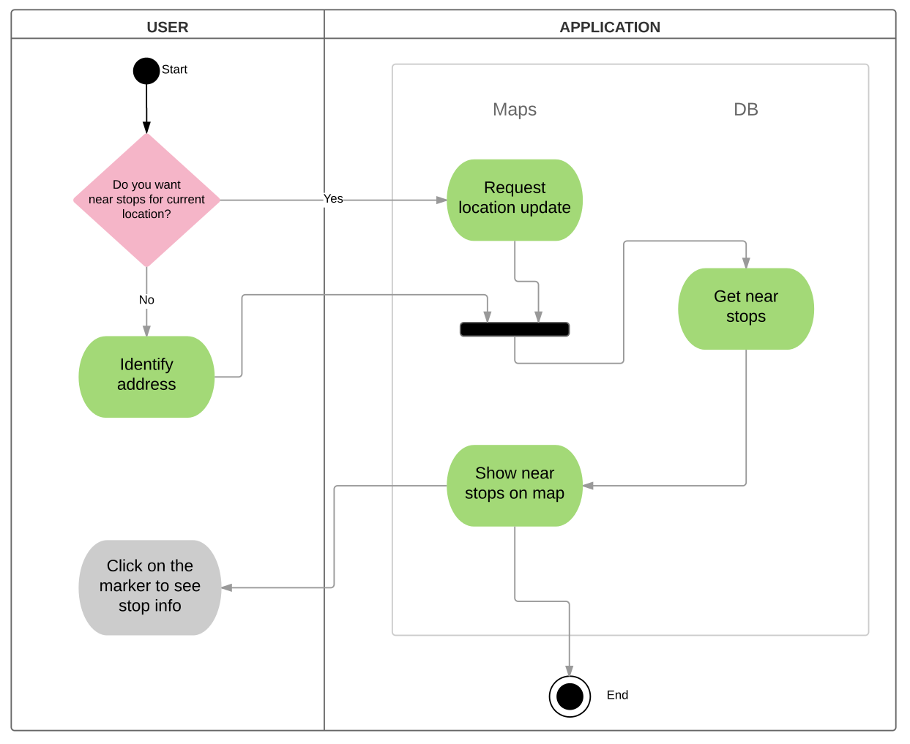

The user can choose between obtain near stops for your current location (determinated by GPS) or identify the desired location manualy. The app will search on database the near stops at that point and display them on the map to the user.

**Route Shape**

  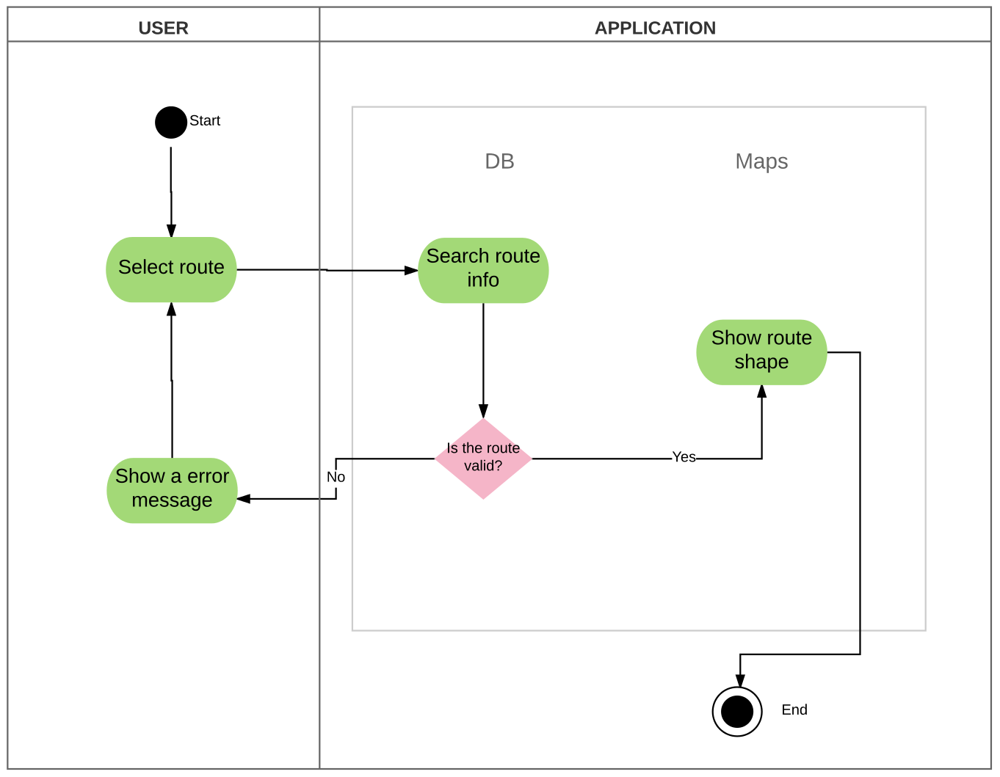

The user can select the desired route. The Melhor Busão will fetch the route information, if it is valid, the shape of the route is showed on the map; if not, an error message appears. 

**Search Schedule**

  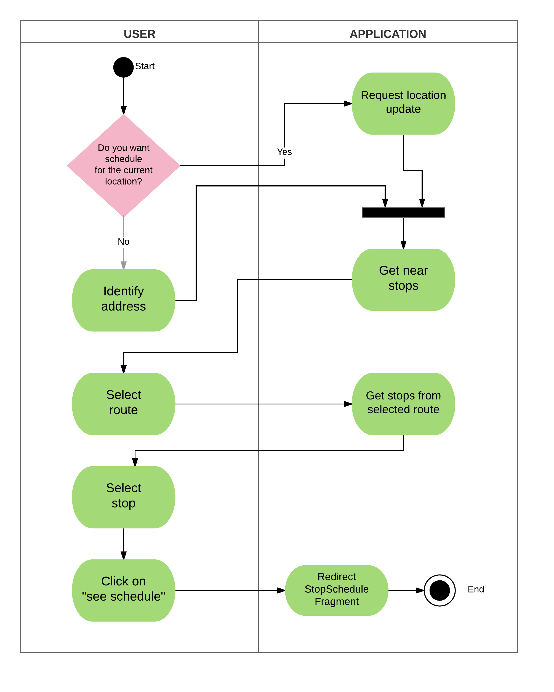

The user can view the schedules planned for the buses that pass in its current location, you can identify the desired address or can directly select which route you want. The Melhor Busão will fetch the stops regarding that route, the use can select the desired stop and see the scheduled times the same.

**Stop Schedule**

  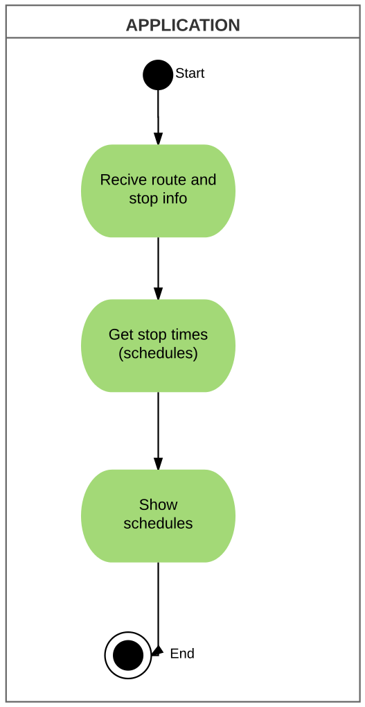

The Melhor Busão receives the information route is desired and search the scheduled times for the selected stop.

